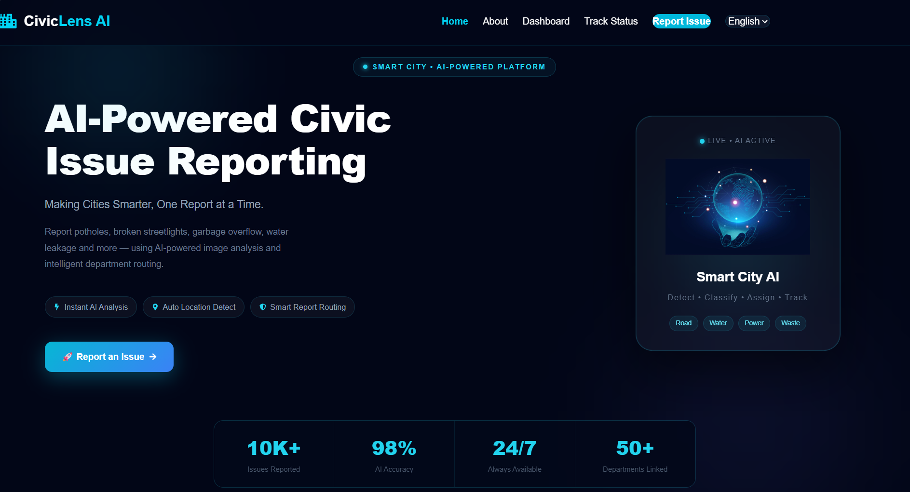
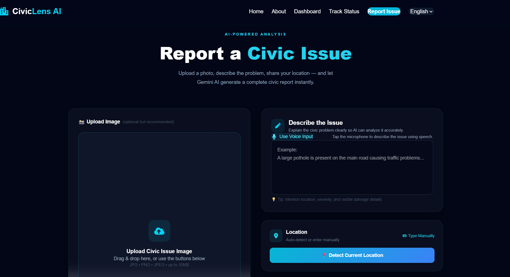
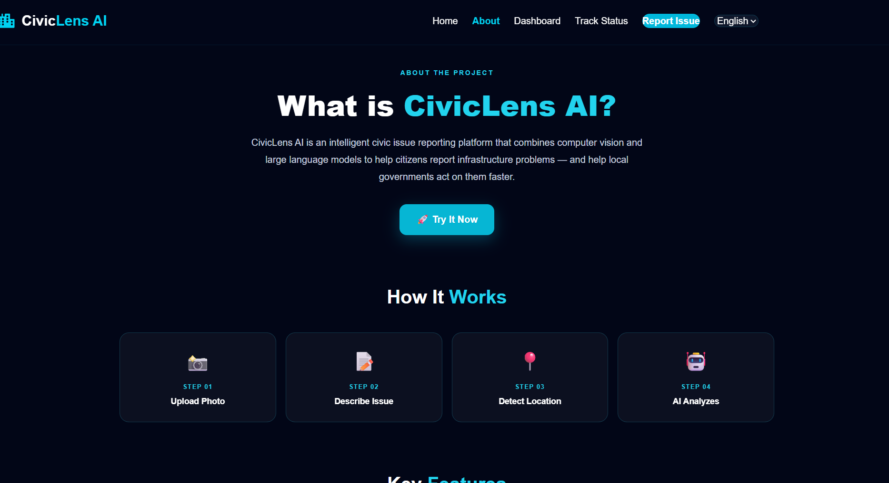

# 🏙️ CivicLens AI

> AI-powered Smart Civic Issue Reporting Platform

CivicLens AI is a full-stack AI-powered web application that enables citizens to report civic issues such as potholes, garbage overflow, water leakage, damaged streetlights, broken roads, and more. The platform uses Google Gemini AI to analyze reported issues and generate intelligent reports with severity, possible cause, suggested action, and the responsible department.

---

## ✨ Features

- 📷 Upload civic issue images
- 📝 Describe civic issues
- 📍 Detect user's current location
- 🤖 AI-powered report generation using Google Gemini AI
- 🏢 Automatic department recommendation
- 🎨 Modern responsive UI
- ⚡ Flask REST API backend
- 🌐 Full-stack architecture

---

# 📸 Screenshots

## 🏠 Home Page



---

## 📝 Report Issue



---

## 🤖 AI Generated Report


---

## ℹ️ About Page



---

# 🛠️ Tech Stack

### Frontend

- React.js
- Tailwind CSS
- Framer Motion
- React Icons

### Backend

- Flask
- Google Gemini AI
- Flask-CORS

### Tools

- Python
- JavaScript
- Git
- GitHub
- VS Code

---

# 📂 Project Structure

```text
CivicLensAI
│
├── backend
│   ├── app.py
│   ├── requirements.txt
│   └── .env
│
├── frontend
│   ├── src
│   ├── public
│   └── package.json
│
├── screenshots
│   ├── home.png
│   ├── report-page.png
│   ├── ai-report.png
│   └── about.png
│
└── README.md
```

---

# 🚀 Installation

## Clone the repository

```bash
git clone https://github.com/tasleensana03-boop/CivicLensAI.git
```

## Frontend Setup

```bash
cd frontend
npm install
npm run dev
```

## Backend Setup

```bash
cd backend
pip install -r requirements.txt
python app.py
```

---

# 🤖 AI Report Includes

- Civic Issue
- Category
- Severity Level
- Possible Cause
- Suggested Action
- Responsible Department

---

# 🎯 Future Enhancements

- 🗺️ Interactive Map Integration
- 📊 Analytics Dashboard
- 🔐 User Authentication
- 📦 Complaint Tracking
- 📱 Mobile Responsive Improvements
- 🧠 AI Image Classification
- 🌍 Multi-language Support

---

# 👩‍💻 Developed By

**Tasleen Sana**

Artificial Intelligence & Data Science Engineering Student

GitHub:
https://github.com/tasleensana03-boop

---

## ⭐ If you found this project useful, consider giving it a star!